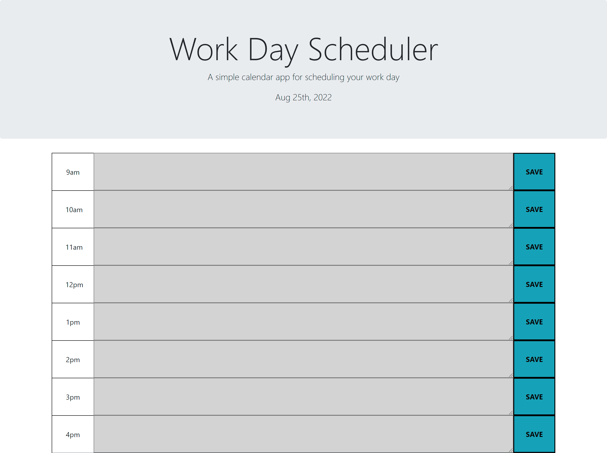

# Work Day Scheduler
## Table of Content
1. [Description](#description)
2. [Visuals](#visuals)
3. [Credits](#credits)

## Description
[Work Day Scheduler](https://christian-hoffman.github.io/work-day-scheduler/)
 
The Work Day Scheduler was built in order to help the user plan their hour by hour tasks during the work day. \
User may enter hourly tasks into the text area where they then may save that change by clicking the SAVE button on the right side. \
The hour slots will be color coded depending on what hour it is for them. \
Present hour is green\
Past hours are grey\
Future hours are red\
**5pm was not added because the work day ends at 5pm so no events may occur after, making a 5pm timeslot obsolete**

## Visuals

 
Screenshot was taken at 6:45 pm. Therefore all hour boxes are grey.
## Credits
Christian Hoffman